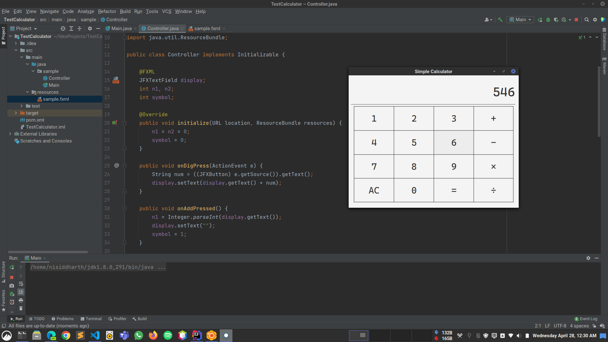

# Java Class - III (Java GUI Class - I)

#### April 27, 2021

<div align="center"></div>

<hr>

## Class content:

-   Installation of Java 8
-   Installation of IntelliJ IDEA
-   Installation of Scene Builder + JFoenix
-   Why Java 8 why not the newer java version?

    For answer: [Click here](https://dzone.com/articles/a-guide-to-java-versions-and-features)

-   Why JavaFx?: [Click here](https://medium.com/@shanekhantsoemoe98/why-should-i-use-javafx-42e41d485178)
    1.  JavaFX can be styled with CSS, whereas Swing cannot be. If we want to style Swing GUIs with CSS, we will need to use third party sources like [flying-saucer](https://code.google.com/archive/p/flying-saucer/). Being able to implement CSS is a unique functionality of JavaFX, and that alone lets programmers easily and swiftly create cool designs in applications.
    2.  JavaFX makes programmers’ life easy by offering [“JavaFX scene builder”](http://www.oracle.com/technetwork/java/javase/downloads/sb2download-2177776.html) with which programmers can create GUI controls like buttons via drag and drop.
    3.  JavaFX supports [Java Lambda expressions](https://docs.oracle.com/javase/tutorial/java/javaOO/lambdaexpressions.html) in action-triggering events unlike Swing. Using Lambda expressions, JavaFX promotes code readability and just needs fewer lines of code than Swing.
    4.  JavaFX has built-in data visualization such as 2D charts
    5.  JavaFX 3D API is an awesome API to create 3D objects in creating games or customizing charts in JavaFX.
    6.  JavaFX is a good alternative GUI for Android and iOS, meaning JavaFX is portable now. Though JavaFX is not as good as native GUIs, it still performs smoothly on both Android and iOS platforms by using [Gluon](http://gluonhq.com/javafx-3d-now-available-android-ios/).

-   Why Desktop Application Development?

    For answer: [Click here](https://www.noodle.com/articles/how-to-become-a-desktop-developer-desktop-is-not-dead).

-   What is JavaFx?
    
    Answer: [Click here](http://tutorials.jenkov.com/javafx/overview.html)

    1.  Stage
    2.  Scenes
    3.  Layouts
    4.  Controls

-   FXML and Controller classes

    1.  Controller classes are only for writing logic of the UI components.
    2.  Other classes may be used for other purposes like fetching data from APIs or connecting to a socket.
    
-   Nomenclature: [Click here](https://www.javatpoint.com/java-naming-conventions)
    1.  Class
    2.  Methods
    3.  Variables

-   Folder Structure
    -   <projectdir>/src/main/java/ - Contains all your java code
    -   <projectdir>/src/main/resources/ - Contains your css, images, and fxml files

-   What is Maven?
    A build automation tool or a package manager 
    Dependencies repository : (https://mvnrepository.com/) 

-   Add following line in pom.xml
    ```xml
    <packaging>jar</packaging>
    ```
- Class result

    
